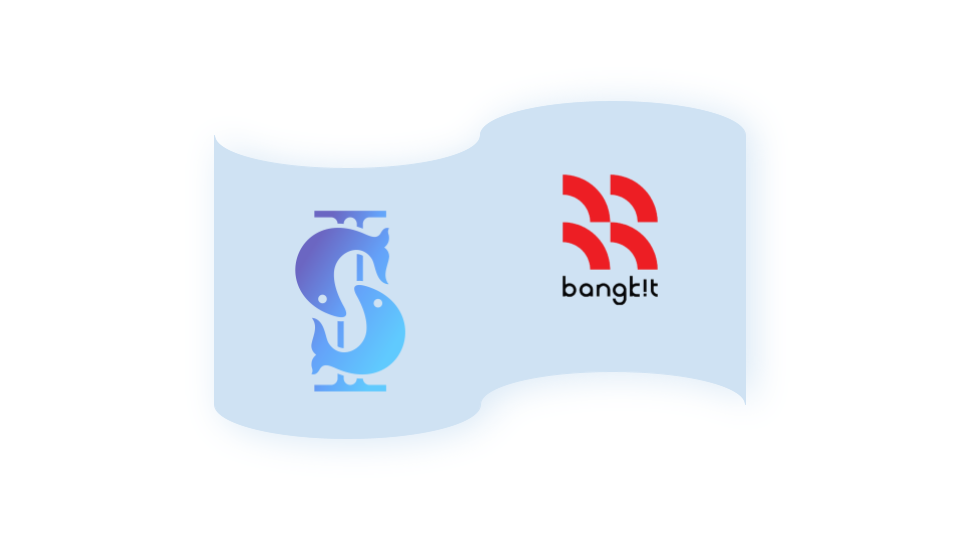

 
## [C23-CD01] Overfishn't - Fisheries Performance Analysis Data Solutions
Our team consists of 3 people who come from Oceanography study program backgrounds who are familiar with ocean problems. The other comes from an IT background . We are also familiar with Big Data. Together we can implement our ideas so that we can then produce a product that is useful in solving fisheries problems, helping the welfare of fishermen, and contributing to maintaining Indonesia's food security.

 

## Team Members
---
### Team ID: C23-CD01 - Build App To Collect Data
| Name                            | Cohort ID          | Learning Path    | University                 | LinkedIn                                                                |
| ------------------------------- | ------------------ | ---------------- | -------------------------- | ----------------------------------------------------------------------- |
| Osmond Willyando                | M017DKX3886        | Machine Learning | Institut Teknologi Bandung | [LinkedIn](https://www.linkedin.com/in/osmond-willyando/)               |
| Chintya Suci Wardani            | M017DKY3765        | Machine Learning | Institut Teknologi Bandung | [LinkedIn](https://www.linkedin.com/in/chintya-suci-wardani-933004194/) |
| Samuel Pandohan Terampil Gultom | M322DSX2142        | Machine Learning | Universitas Presiden       | [LinkedIn](https://www.linkedin.com/in/pandohansamuel19/)               |
| Achmad Agung Bachtiar           | C166DSX1646        | Cloud Computing  | Universitas Diponegoro     | [LinkedIn](https://www.linkedin.com/in/achmaadagung/)                   |
| Jevin Arda Prayoga              | C282DKX3873        | Cloud Computing  | Universitas Negeri Malang  | [LinkedIn](https://www.linkedin.com/in/jevinarda/)                      |
| Achmad Agung Bachtiar           | C166DSX1646        | Cloud Computing  | Institut Teknologi Bandung | [LinkedIn](https://www.linkedin.com/in/osmond-willyando/)               |
| Jevin Arda Prayoga              | C282DKX3873        | Cloud Computing  | Institut Teknologi Bandung | [LinkedIn](https://www.linkedin.com/in/osmond-willyando/)               |
| Nico Kangdra                    | C322DSX0603        | Cloud Computing  | Universitas Presiden       | [LinkedIn](https://www.linkedin.com/in/nico-kangdra-10378326a/)         |
 

## Infrastructure Schemas

  

## More Documentations
1. [Machine Learning]()
2. [Cloud Infrastructure: Machine Learning API]()